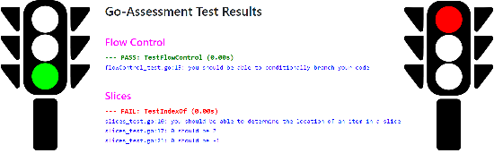

# go-assessment

## GO - Assessment

[Inspired by Rebecca Murphey's js-assessment](https://github.com/rmurphey/js-assessment)

I found her js-assessment to be a valuable tool for refreshing my javascript capability, when I
had not written any JavaScript for a few months. A similar tool for Go might be useful
for the same reason. The tool will be useful for Go beginners to move beyond a tutorial and
implement some simple (and a few not-so-simple) Go code without being spoon fed.

This tool is not meant to be a leetcode challenge. The point is to exercise your skill with some basic syntax and semantics of Go.
Most of the tests and implementations are straightforward. A few are harder, require a bit of
algorithm knowledge or the ability to look up a solution. If you have gone through the
official golang tutorial you will know enough to make most of the tests pass. For the rest
go ahead and look up a solution if you need to. Feel free to use go standard libraries.
No need to reinvent the wheel.

This tool relies on Test Driven Development using the
[native Go test framework](https://golang.org/pkg/testing/). The ./app directory
contains a set of test files (app/_topic_\_test.go) and a corresponding app skeleton file (app/_topic_.go) with
the required function definitions but missing the implementations. Treat the _topic_\_test.go files
are the specifications for the function skeletons. The goal is to provide the implementations in the
skeleton files to pass the tests. If the tests are not passing, dig into the _topic_\_test.go files
to figure out what the requirement is, then fix the skeleton file so the tests pass.
You are done when all tests pass. You should not have to modify anything in the _topic_\_test.go files,
only the _topic_.go skeleton files (unless the tests have a bug in which case feel free to report it).

Note: if you have a compile error in a function under test (inside one of the _topic_.go files) it will terminate the tests for that topic. You will (probably) get an error message describing where and what the compiler error is.

The tests are ordered (more or less) in increasing order of difficulty. The topics covered include

- Operators
- Flow Control
- Strings
- Slices
- Binary
- Functions
- Recursion
- Methods
- Regexp
- Async

Here's how to work this:

1. set up Go
2. clone this repo
3. Start the browser based test framework (test_browser.sh or test_browser.cmd). Open a browser to the host:port

- Loop
  - refresh the page to run the tests
  - modify the skeleton files in ./app until the test passes
  - go to the next test

#### Running the Tests

To run the tests and see their results you have some choices.

1. From the Shell
   - you can run individual test files using 'go test...'
     - example for the strings test
     - \[linux/macos\]: 'go test -v ./app/strings\*.go ./app/test_util.go ./app/app_types.go'
     - \[windows\]: 'go test -v ./app/strings.go ./app/strings_test.go ./app/test_util.go ./app/app_types.go'
   - run a shell script that runs all the tests and writes the output to 'results.txt'
     - for Linux or Mac, the script is 'test_all.sh'
     - for Windows, the script is 'test_all.cmd'
       - if your tests and other go programs build slowly on Windows, its probably due to Windows Defender or other antivirus
2. From a web browser : **best**
   - the tool includes a web server implementation that will run the tests and display the results for you.
     - in the root of the repo, run './test_browser.sh' (or './test_browser.cmd') and connect to the ip:8080 with a browser. You will get a display of all the test results.
     - after editing skeleton files, you can update the test results by refreshing the web page. this will rerun the tests and update the results.
     - you don't need to restart the web server when you change a function under test. just refresh the page. If you modify a _topic_\_test.go file, you would need to restart the server.
   - the browser tool needs to be connected to the internet because it uses Bootstrap from a CDN. If you want to run locally you can download the required bootstrap files and modify './static/index.html' to point to their local copies.
   - You can change the port number in './main.go' or in the startup scripts.

#### Debugging the functions under test

1. Visual Studio Code (Or other debugger with similar capability)

Visual Studio Code set up for Go programming provides the capability to run individual tests and use breakpoints and other debugger functions.

With this setup, you can run individual tests within the _topic_\_test.go functions. VS Code will superimpose buttons
at the top of each test to let you run or debug the test function. This allows you to step into the actual function
under test and observe it. You should never have to change anything in the _topic_\_test.go function itself.

This is independent of whether or not the browser test setup is running. You can do both at the same time. If you
are viewing the browser based test output while editing with VS Code and you need to debug a specific test, you can
use the VS Code test debug function and still update results with a browser refresh

2. Logging output in a function under test

If you want to print some debug output inside a from function under test, the test*util.go file provides the \_testLog(s string)* function.
You can print output using _testLog_ from within a function in an app skeleton file. Due to the way the golang testing system works, the output from these logs will come after the results for that test are printed. The log output specifies the file and line number of where the testLog was called.
